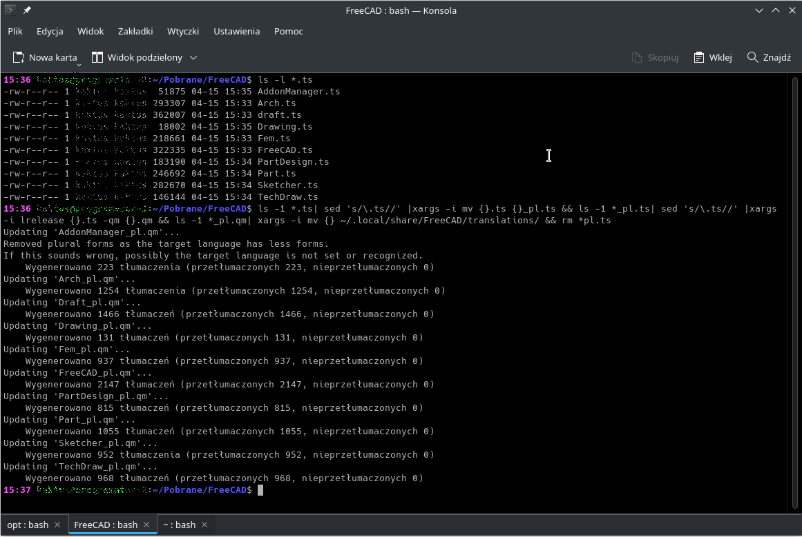
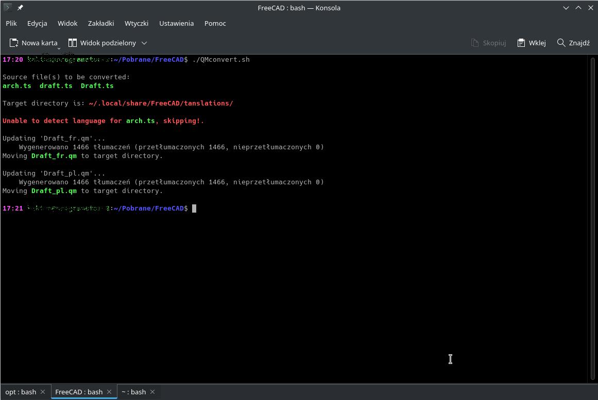

## FreeCAD translations

[](https://crowdin.com/project/freecad)

Tracking FreeCAD localization and progress

### Contribute

**Important Note**: in order to maintain accuracy we ask that users install and run the most cutting edge development version of FreeCAD. This can be achieved in 2 ways:

1. Installing the latest pre-built development snapshots at https://github.com/FreeCAD/FreeCAD-Bundle/releases/tag/weekly-builds
2. Compiling FreeCAD yourself

Then create an account on the crowdsourced translation site we utilize on [Crowdin](https://crowdin.com/project/freecad)


#### Missing translations

If you're running the latest development snapshot and have found a missing translation for you language or a section of the UI isn't translated, please double-check [Crowdin](https://crowdin.com/project/freecad) to confirm. If so, then please open a [ticket](https://github.com/FreeCAD/FreeCAD-translations/issues) so we can track the issue.

#### Incorrect translations

Please use Crowdin to create an issue to discuss this with the language team. A proofreader or a manager will be able to change the translation. So please find out who those users are.

#### Translations are not in FreeCAD

Every so often we push new strings thast require translation in to Crowdin and pull translation back in to FreeCAD. Sometimes there is a window of time where we haven't done this. In this case translations won't go 'live' until we do this. Please be patient.

### Testing

Testing the "quality" of translations is a very valuable capability for FreeCAD GUI translators.
Thanks to this possibility you can check on a "living organism" whether the translated string is displayed correctly. You can adjust the form of the words used, without waiting unnecessarily for a new release.
Without this the GUI interface would contain many grammatical and linguistic errors. Even in some cases would not be understandable to the user. And applying corrections to the current translations would be a tedious and very very time consuming process.

#### What you will need:
- an active account with minimum translator privileges in Crowdin for FreeCAD,
- a computer running Linux, and the **qttools5-dev-tools** package *(Debian-based OS)* installed,
- a current development version of FreeCAD, available for download from the Git repository
- not required, but helpful **Qt Linguist** for viewing source files *(this is for folks more involved in GUI translation)*,
- and of course a lot of available time.

#### Step-by-step
1. Log in to your Crowdin account, and open a FreeCAD project.
Select your language to work with.
eg: https://crowdin.com/project/freecad/pl# , or https://crowdin.com/project/freecad-addons/pl .
The list of source files is presented on the screen with the current stage of work *(translation and approval progress)*.
At the end of each line there is an icon of three dots. After clicking it you can download a given source file to your local disk.
Beforehand you can prepare a folder for yourself to perform the necessary conversion, where you will save the downloaded source files.

    **Important Note**: do not change the file names and extension. With one exception, you will read about it below.

2. In this step we will convert the source files to a format acceptable by FreeCAD *(.qm)*. Your system should already have the required tools installed *(the package mentioned at the beginning)*.
Run the CLI shell, access the folder with the downloaded .ts file*(s)*.

    Before running the command to convert source files there are some important things you need to know:
    - command after performing the conversion and moving the converted files to a new location will delete the downloaded source files from the folder where the conversion is performed,
    - you should check the location of the destination folder for converted source files text string translations,
By default the folder is ` ~/.local/share/FreeCAD/translations/` *(previously it was ` ~/.FreeCAD/translations/`)*
since the release of: ***0.20.26306** (Git) AppImage*, it has a changed location for the translation files directory. To find it out use the command `App.getUserAppDataDir()` in the Python console of FreeCAD.
    - the example refers to files for Polish language: the tag - **pl**. 
For other languages ISO codes of selected country should be used.
    - this is a complex command with pipelining, so be careful not to miss any characters.
    - the special case of renaming a source file for conversion:
        The Draft Workbench source file is downloaded from Crowdin *(as the only one)* with an invalid file name. The error is the name starting with a lowercase letter. In order for the file to be accepted by FreeCAD you must ensure that the file name starts with a capital letter. It is best to take care of this before performing the conversion. The correct file name: ***D**raft.ts*

To perform the source file(s) conversion type at the command line prompt:
```
ls -1 *.ts| sed 's/\.ts//' |xargs -i mv {}.ts {}_pl.ts && ls -1 *_pl.ts| sed 's/\.ts//' |xargs -i lrelease {}.ts -qm {}.qm && ls -1 *_pl.qm| xargs -i mv {} ~/.local/share/FreeCAD/translations/ && rm *pl.ts
```
Remember this is just a working example. The task can be done in other ways - you can even prepare a shell script.

   Example conversion process:
   
   
3. To test the quality of your translations you should always use the latest development version of FreeCAD. This will ensure the compatibility of the program code with the source files containing the translation text.
You can download the latest release from the FreeCAD repository on [GitHub](https://github.com/FreeCAD/FreeCAD-Bundle/releases/tag/weekly-builds)

    **Thanks to this possibility it is not necessary to compile the program from sources.**

    After performing the conversion and moving the newly created files to the appropriate location start FreeCAD to enjoy the changes in the GUI translation.

4. The **Qt Linguist** tool can provide additional information when viewing the source file. However it's ***not recommended*** making local changes to the source file unless you are aware of what you are doing or you want to do some additional testing yourself.

 ##### Bash script  *(2022-04-17)*
   Due to the great interest in this topic by the international community - a universal script was created to support the work of translators.

   - automatically converts any number of source files - 1 ... 3 ... 8 ...
   - adjusts the file name to the required criteria
   - independently recognizes the language of the source file
   - moves converted files to the appropriate FreeCAD folder

   [QMconvert script](QMconvert.sh)

   Example conversion process:
   
   
 ##### Bash script  *(2024-02-19)*
   There's a new version of the compilation script available. Essentially, it doesn't do anything more than the previous one. However, a small fix has been introduced regarding language and region detection. This will be a significant improvement for translators who use a two-part language code.
   You can download the bash script here:
   
   [QMconvert2 script](https://github.com/kaktusus/FreeCAD-translators-tools/blob/main/README.md)
    
### Discussion
You're welcome to join the discussion on the [FreeCAD forum](https://forum.freecad.org/viewforum.php?style=4&f=45). Translators have their own corner there.

